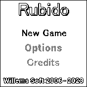

# Rubido
Rubido is a little chinese checkers or solitaire game with four difficulties.

  

## Game Features:

- Four difficulties
- Saves best results
- Uses colors from watches current theme
- fullscreen game (no widgets are shown)

## Playing the Game:
The aim of the game in chinese checkers is to select a peg on the board and jump over another peg to land on an empty spot. When doing this the peg you jumped over will be removed from the board.
You need to play the game in such a way that only one peg remains on the board at the end. Depending on the difficulty you had chosen this can be either (only) in the middle of the board or anywhere on the board.
Also depending on the difficulty you had chosen you can either jump horizontally and veritically over pegs or diagonally as well.

Note: Empty spots always use the color of the background and spots containing a peg the color of the foreground / selector.

## Diffuclties 

### Very Easy

- Jump over Pegs vertically, horizontally and diagonally
- Last Peg can be anywhere on the board

### Easy

- Jump over Pegs vertically, horizontally and diagonally
- Last Peg must end on the middle board

### Hard

- Jump over Pegs vertically and horizontally only
- Last Peg can be anywhere on the board

### Very Hard

- Jump over Pegs vertically and horizontally only
- Last Peg must end on the middle board

## Controls
| Button | Action                                                                   |
|--------|--------------------------------------------------------------------------|
| Upper screen Touch | Move up in menus, Move selector up during gameplay |
| Lower screen Touch | Move down in menus, Move selector down during gameplay |
| Left screen Touch | Move selector left during gameplay |
| Right screen Touch | Move selector right during gameplay |
| Middle screen Touch | Confirm in menu and level selector, (De)select a Peg |
| Btn or long middle screen touch | Back in menus, difficulty selector and game |

## Requests
You can contact me on my [github](https://github.com/joyrider3774)

## Creator

[Willems Davy](https://github.com/joyrider3774)
